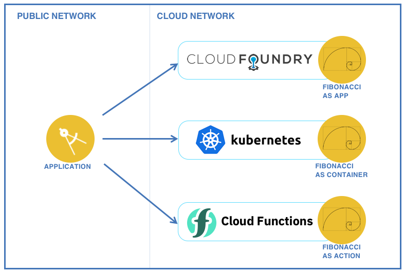

# One micro-service, multiple deployment options

This project contains one simple micro-service that gets deployed:
* as a Cloud Foundry application,
* as a container in a Kubernetes cluster
* and as an OpenWhisk action.

  

## Requirements

* IBM Bluemix account. [Sign up][bluemix_signup_url] for Bluemix, or use an existing account.
* [Bluemix CLI](http://clis.ng.bluemix.net/)
* [OpenWhisk CLI](https://console.ng.bluemix.net/openwhisk/learn/cli)
* [Bluemix Container Registry plugin](https://console.ng.bluemix.net/docs/cli/plugins/registry/index.html)
* [Bluemix Container Service plugin](https://console.ng.bluemix.net/docs/containers/cs_cli_devtools.html)
* Node.js 6.9.1
* Kubernetes CLI version 1.5.3 or later
* Docker CLI version 1.9. or later

## About the micro-service

The micro-service used in this project computes Fibonacci numbers.

From [Wikipedia](https://en.wikipedia.org/wiki/Fibonacci_number), *In mathematics, the Fibonacci numbers are the numbers in the following integer sequence, called the Fibonacci sequence, and characterized by the fact that every number after the first two is the sum of the two preceding ones:*

  ```
  0, 1, 1, 2, 3, 5, 8, 13, 21, 34, 55, 89, 144, ...
  ```

The implementation of the Fibonacci sequence is done in **[service/lib/fibonacci.js](service/lib/fibonacci.js)**. The same implementation is used across all deployment options.

## Deploying the service manually in Bluemix

Follow [these instructions](./DEPLOY_MANUALLY.md).

## Code Structure

### Cloud Foundry application

| File | Description |
| ---- | ----------- |
| [app.js](service/app.js) | Main application, start the express web server and expose the service API|
| [lib/fibonacci.js](service/lib/fibonacci.js) | The implementation of the Fibonacci sequence, shared by all deployment options|
| [package.json](service/package.json) | List the packages required by the application |
| [manifest.yml](service/manifest.yml) | Description of the application to be deployed |
| [.cfignore](service/.cfignore) | List files to ignore when deploying the application to Cloud Foundry |

### Kubernetes deployment

| File | Description |
| ---- | ----------- |
| [app.js](service/app.js) | Main application, start the express web server and expose the service API|
| [lib/fibonacci.js](service/lib/fibonacci.js) | The implementation of the Fibonacci sequence, shared by all deployment options|
| [package.json](service/package.json) | List the packages required by the application |
| [Dockerfile](service/Dockerfile) | Description of the Docker image |
| [fibonacci-deployment.yml](service/fibonacci-deployment.yml) | Specification file for the deployment of the service in Kubernetes |

### OpenWhisk action

The OpenWhisk action is deployed as a [zip action](https://console.ng.bluemix.net/docs/openwhisk/openwhisk_actions.html#openwhisk_create_action_js) where several files are packaged into a zip file and the zip file is passed to OpenWhisk as the implementation for the action. **[deploy.js](service/deploy.js)** takes care of packaging the zip file.

| File | Description |
| ---- | ----------- |
| [handler.js](service/action/handler.js) | Implementation of the OpenWhisk action |
| [lib/fibonacci.js](service/lib/fibonacci.js) | The implementation of the Fibonacci sequence, shared by all deployment options |
| [package.json](service/action/package.json) | Specify the action entry point (handler.js) |
| [deploy.js](service/deploy.js) | Helper to deploy and undeploy the OpenWhisk action |

## Contribute

Please create a pull request with your desired changes.

## Troubleshooting

### Cloud Foundry

  Use
  ```
  cf logs fibonacci-service
  ```
  to look at the live logs for the web application

## License

See [License.txt](License.txt) for license information.

[bluemix_signup_url]: https://console.ng.bluemix.net/?cm_mmc=GitHubReadMe
