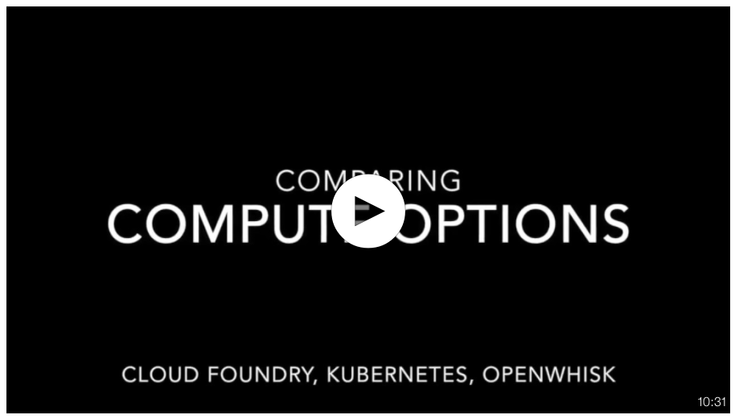

# One micro-service, multiple deployment options

This project contains one simple micro-service that gets deployed:

* as a [Cloud Foundry](https://www.cloudfoundry.org/) application,
* as a container in a [Kubernetes cluster](https://kubernetes.io/),
* and as a [Cloud Functions](http://openwhisk.org/) action.

   <center>
      
   </center>

Watch this Youtube video that walks you through the deployment of the service and test the behavior of the deployment options when the service crashes:

   <center>
      <a href="https://youtu.be/Bdl9s2LxUZo"></a>
   </center>

## Requirements

* An IBM Cloud account. Either [sign up][bluemix_signup_url], or use an existing account.

## About the micro-service

The micro-service used in this project computes Fibonacci numbers.

From [Wikipedia](https://en.wikipedia.org/wiki/Fibonacci_number): *In mathematics, the Fibonacci numbers are the numbers in the following integer sequence, called the Fibonacci sequence, and characterized by the fact that every number after the first two is the sum of the two preceding ones:*

  ```
  0, 1, 1, 2, 3, 5, 8, 13, 21, 34, 55, 89, 144, ...
  ```

The implementation of the Fibonacci sequence is done in **[service/lib/fibonacci.js](service/lib/fibonacci.js)**. The same implementation is used across all deployment options.

## Deploy the services in IBM Cloud with the toolchain

1. Identify an IBM Cloud region, Cloud Foundry organization and space where to deploy the services.

1. Create a **standard** Kubernetes cluster

1. Create a registry namespace

And then

[](https://console.ng.bluemix.net/devops/setup/deploy/?repository=https://github.com/IBM-Bluemix/multiple-deployment-options&branch=refresh)

1. Select the **GitHub** box.
   1. Decide whether you want to clone or fork the repository.
   1. If you decide to Clone, set a name for your GitHub repository.
1. Select the **Delivery Pipeline** box.
   1. Specify the IBM Cloud API key to use or create one
   1. Select the region, organization and space where you want to deploy the web application. A random route will be used for the application.
   :warning: Make sure the organization and the space have no space in their names.
   1. Select the Kubernetes cluster where to deploy the service, together with the Docker registry name where to store the Docker image
1. Click **Create**.
1. Select the Delivery Pipeline.
1. Wait until all stages complete.
1. Open the _Deploy_ log for the CLOUD FOUNDRY, CLOUD FUNCTIONS and KUBERNETES stages. Each log has a link at the end pointing to the location where the services have been deployed. Click on the links to add the service to the visual tester.

1. The services are ready. Review the [Service API](README.md#Service_API) to call the services.

## Service API

Once deployed, the service implements 3 API calls:
* compute the Fibonacci number after *n* iterations,
* let the computation run for *t* milliseconds,
* and simulate a crash of the service.

Depending on which compute option you are using, use the following cURL calls:

| Endpoint Type | Endpoint  | URL                                      |
| ------------- | --------- | ---------------------------------------- |
| Cloud Foundry | iteration | `curl -v http://fibonacci-service-<random-string>.mybluemix.net/fibonacci?iteration=1000` |
|               | duration  | `curl -v http://fibonacci-service-<random-string>.mybluemix.net/fibonacci?duration=5000` |
|               | crash     | `curl -v -X POST http://fibonacci-service-<random-string>.mybluemix.net/fibonacci?crash=true` |
| Kubernetes    | iteration | `curl -v http://<cluster-ip>:30080/fibonacci?iteration=1000` |
|               | duration  | `curl -v http://<cluster-ip>:30080/fibonacci?duration=5000` |
|               | crash     | `curl -v -X POST http://<cluster-ip>:30080/fibonacci?crash=true` |
| Cloud Functions     | iteration | `curl -v https://openwhisk.ng.bluemix.net/api/v1/web/<namespace>/default/fibonacci?iteration=1000` |
|               | duration  | `curl -v https://openwhisk.ng.bluemix.net/api/v1/web/<namespace>/default/fibonacci?duration=5000` |
|               | crash     | `curl -v -X POST https://openwhisk.ng.bluemix.net/api/v1/web/<namespace>/default/fibonacci?crash=true` |

## Code Structure

### Cloud Foundry application

| File                                     | Description                              |
| ---------------------------------------- | ---------------------------------------- |
| [app.js](service/app.js)                 | Main application, start the express web server and expose the service API |
| [lib/fibonacci.js](service/lib/fibonacci.js) | The implementation of the Fibonacci sequence, shared by all deployment options |
| [package.json](service/package.json)     | List the packages required by the application |
| [manifest.yml](service/manifest.yml)     | Description of the application to be deployed |
| [.cfignore](service/.cfignore)           | List files to ignore when deploying the application to Cloud Foundry |

### Kubernetes deployment

| File                                     | Description                              |
| ---------------------------------------- | ---------------------------------------- |
| [app.js](service/app.js)                 | Main application, start the express web server and expose the service API |
| [lib/fibonacci.js](service/lib/fibonacci.js) | The implementation of the Fibonacci sequence, shared by all deployment options |
| [package.json](service/package.json)     | List the packages required by the application |
| [Dockerfile](service/Dockerfile)         | Description of the Docker image          |
| [fibonacci-deployment.yml](service/fibonacci-deployment.yml) | Specification file for the deployment of the service in Kubernetes |

### Cloud Functions action

The Cloud Functions action is deployed as a [zip action](https://console.ng.bluemix.net/docs/openwhisk/openwhisk_actions.html#openwhisk_create_action_js) where several files are packaged into a zip file and the zip file is passed to Cloud Functions as the implementation for the action. **[deploy.js](service/deploy.js)** takes care of packaging the zip file.

| File                                     | Description                              |
| ---------------------------------------- | ---------------------------------------- |
| [handler.js](service/action/handler.js)  | Implementation of the Cloud Functions action   |
| [lib/fibonacci.js](service/lib/fibonacci.js) | The implementation of the Fibonacci sequence, shared by all deployment options |
| [package.json](service/action/package.json) | Specify the action entry point (handler.js) |
| [deploy.js](service/deploy.js)           | Helper to deploy and undeploy the Cloud Functions action |

### Tester web app

Under the `tester` directory is a simple web application to register and test the deployed micro-services. It can be pushed to IBM Cloud with `cf push` or simply executed locally with `python -m SimpleHTTPServer 28080` as example.

## Contribute

Please create a pull request with your desired changes.

## Troubleshooting

### Cloud Foundry

  Use
  ```
  ibmcloud cf logs fibonacci-service
  ```
  to look at the live logs for the web application.

### Kubernetes

  Use
  ```
  kubectl proxy
  ```
  and look at the status of the resources in the console.

### Cloud Functions

  Use
  ```
  ibmcloud cloud-functions activation poll
  ```
  and perform an invocation of the action.

## License

See [License.txt](License.txt) for license information.

[bluemix_signup_url]: https://console.ng.bluemix.net/?cm_mmc=GitHubReadMe
